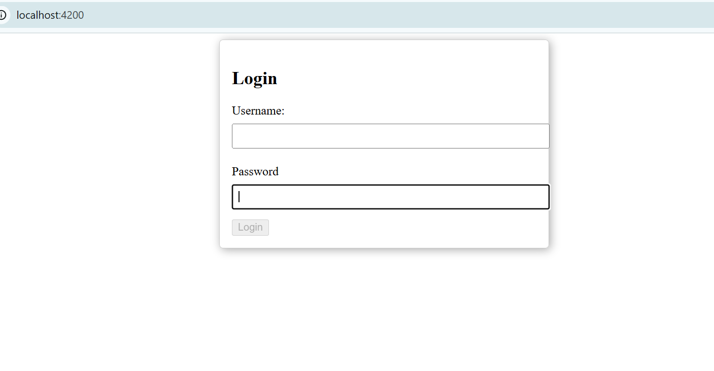

# AngularExploration

This project was generated with [Angular CLI](https://github.com/angular/angular-cli) version 13.3.11.

## Development server

Run `ng serve` for a dev server. Navigate to `http://localhost:4200/`. The application will automatically reload if you change any of the source files.

## Code scaffolding

Run `ng generate component component-name` to generate a new component. You can also use `ng generate directive|pipe|service|class|guard|interface|enum|module`.

## Build

Run `ng build` to build the project. The build artifacts will be stored in the `dist/` directory.

## Running unit tests

Run `ng test` to execute the unit tests via [Karma](https://karma-runner.github.io).

## Running end-to-end tests

Run `ng e2e` to execute the end-to-end tests via a platform of your choice. To use this command, you need to first add a package that implements end-to-end testing capabilities.

## Further help

To get more help on the Angular CLI use `ng help` or go check out the [Angular CLI Overview and Command Reference](https://angular.io/cli) page.

## When to choose Angular:
----------------------
1. Full-Featured Framework:
      Angular is a comprehensive framework that includes everything you need for building 
	  applications (routing, state management, HTTP client, forms, etc.), which can speed up development.
 
2. Enterprise-Level Applications:
 
     If you’re building large-scale, complex applications, Angular’s structure and built-in 
	 features (like dependency injection) can help manage complexity. Strong Typing with TypeScript:
 
     Angular is built with TypeScript, providing strong typing and better tooling support, which can lead to fewer 
	 runtime errors and improved maintainability.
 
3. Two-Way Data Binding:
 
     Angular’s two-way data binding simplifies synchronization between the model and the view, which can be
	 beneficial for certain types of applications.
4. Standardization:
 
     Angular provides a more opinionated structure and conventions, which can be beneficial for teams looking for a 
	 standard way to build applications.
 
5. Support for MVC Architecture:
 
    Angular follows a Model-View-Controller (MVC) architecture, making it suitable for developers familiar with this pattern.

 
When to choose React js:
------------------------
1. Flexibility and Simplicity:
 
    React is a library, not a full framework, allowing you to choose other libraries for routing, state management, etc. 
	This flexibility can be beneficial for small to medium-sized applications.
2. Component-Based Architecture:
 
    React’s component-based architecture promotes reusability and easier management of UI elements, making it suitable for 
	dynamic user interfaces.
3. Performance:
 
    React’s virtual DOM improves performance, especially in applications with frequent UI updates, making it a good choice 
	for high-performance applications.
4. Rich Ecosystem:
 
    React has a large ecosystem and community, providing access to numerous libraries, tools, and resources for various 
	needs (like state management with Redux).
5. Learning Curve:
 
    Many developers find React’s learning curve to be gentler, especially if they are already familiar with JavaScript 
	and functional programming concepts.
6. Popularity:
 
    React is widely adopted and has strong community support, making it easier to find resources, tutorials, and developers
	familiar with it.

##Sample screenshot

